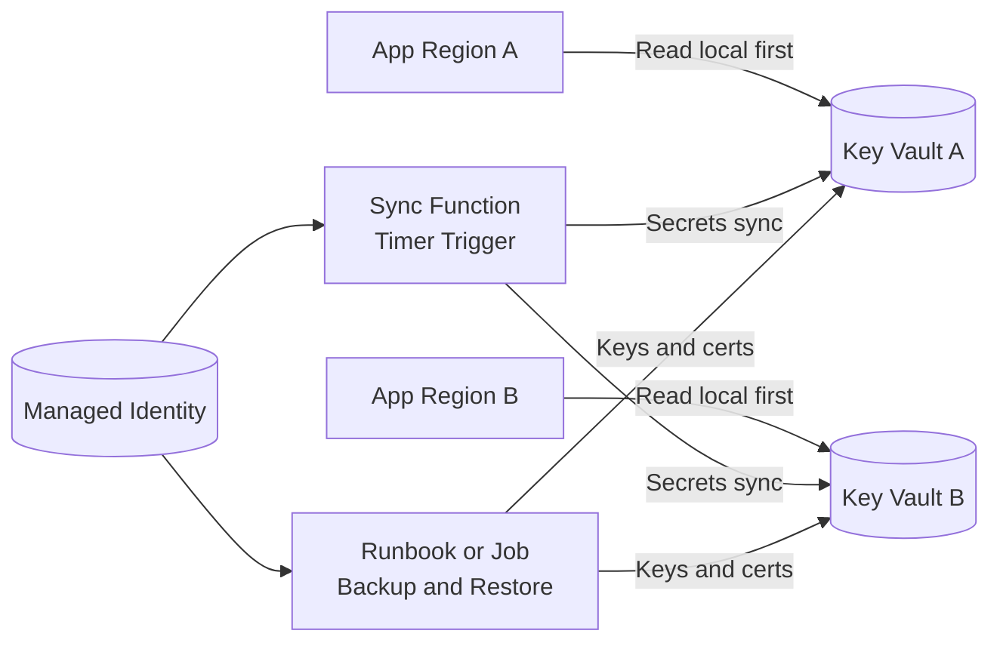

# Key Vault Replication Automation Examples for Applications

Created: 2026-07-28

## Executive summary

For nonpaired regions, Azure Key Vault does not provide customer-controlled cross-region failover. The reliable pattern is to run one vault per region and automate synchronization of required objects.

This document provides practical examples you can adapt:

1. Timer-based secret replication with Azure Functions and Managed Identity.
2. Backup/restore replication for keys and certificates.
3. IaC baseline for two regional vaults with RBAC and private endpoints.
4. Application startup logic that prefers local vault and falls back to secondary vault.

## When to use each pattern

| Pattern | Best for | Notes |
| --- | --- | --- |
| Secret value sync | Application secrets (connection strings, API secrets) | Works when your automation is allowed to read secret values. |
| Backup/restore sync | Keys and certificates | Preserves object material without exporting private key contents in plaintext. |
| Source-of-truth push | CI/CD-managed secrets | Strong for consistency across regions and environments. |
| App-side failover | Runtime continuity | Application must know primary and fallback vault URIs. |

## Reference architecture



## Prerequisites

- Two Azure regions selected for the same workload boundary.
- One Key Vault per region per environment.
- Soft delete and purge protection enabled on both vaults.
- Azure RBAC enabled on both vaults.
- Private endpoints and private DNS configured if using private access.
- Managed identity with least privilege for sync automation.

Recommended RBAC roles for automation identity:

- For secret sync: `Key Vault Secrets Officer` on both vaults.
- For key backup/restore: `Key Vault Crypto Officer` on both vaults.
- For certificate backup/restore: `Key Vault Certificates Officer` on both vaults.

## Example 1: Timer-based secret replication with Azure Functions (Python)

This example copies selected secrets from Vault A to Vault B every 5 minutes.

### 1. Deploy and configure the function app

```azurecli
# Variables
SUBSCRIPTION_ID=<subscription-id>
RG=<resource-group>
LOC_A=eastus2
LOC_B=mexicocentral
KV_A=kv-app-prod-eastus2-001
KV_B=kv-app-prod-mexicocentral-001
FUNC=func-kv-sync-prod-001
STG=stkvsyncprod001

az account set --subscription $SUBSCRIPTION_ID

# Function app (Linux Consumption shown as example)
az storage account create -g $RG -n $STG -l $LOC_A --sku Standard_LRS
az functionapp create \
  --name $FUNC \
  --resource-group $RG \
  --consumption-plan-location $LOC_A \
  --runtime python \
  --runtime-version 3.12 \
  --functions-version 4 \
  --storage-account $STG

# Enable system-assigned managed identity
az functionapp identity assign -g $RG -n $FUNC

# Get principal id
PRINCIPAL_ID=$(az functionapp identity show -g $RG -n $FUNC --query principalId -o tsv)

# Grant least-privilege RBAC on each vault
az role assignment create --assignee-object-id $PRINCIPAL_ID --assignee-principal-type ServicePrincipal --role "Key Vault Secrets Officer" --scope $(az keyvault show -n $KV_A --query id -o tsv)
az role assignment create --assignee-object-id $PRINCIPAL_ID --assignee-principal-type ServicePrincipal --role "Key Vault Secrets Officer" --scope $(az keyvault show -n $KV_B --query id -o tsv)

# App settings
az functionapp config appsettings set -g $RG -n $FUNC --settings \
  SOURCE_VAULT_URI="https://$KV_A.vault.azure.net" \
  TARGET_VAULT_URI="https://$KV_B.vault.azure.net" \
  SECRET_FILTER_PREFIX="app-"
```

### 2. Function code

```python
import datetime
import logging
import os
from azure.identity import DefaultAzureCredential
from azure.keyvault.secrets import SecretClient


def _should_replicate(secret_name: str, prefix: str) -> bool:
    return secret_name.startswith(prefix) if prefix else True


def _is_drifted(source_props, target_props) -> bool:
    # Drift check uses updated timestamp and tags as a cheap compare.
    return (
        target_props is None
        or target_props.updated_on != source_props.updated_on
        or (target_props.tags or {}) != (source_props.tags or {})
    )


def main(mytimer) -> None:
    if mytimer.past_due:
        logging.warning("Timer is running late")

    source_uri = os.environ["SOURCE_VAULT_URI"]
    target_uri = os.environ["TARGET_VAULT_URI"]
    prefix = os.getenv("SECRET_FILTER_PREFIX", "")

    credential = DefaultAzureCredential()
    source = SecretClient(vault_url=source_uri, credential=credential)
    target = SecretClient(vault_url=target_uri, credential=credential)

    replicated = 0
    skipped = 0

    for props in source.list_properties_of_secrets():
        if not _should_replicate(props.name, prefix):
            continue

        source_secret = source.get_secret(props.name)

        target_props = None
        try:
            target_props = target.get_secret(props.name).properties
        except Exception:
            # Secret not found in target vault.
            pass

        if _is_drifted(source_secret.properties, target_props):
            target.set_secret(
                name=source_secret.name,
                value=source_secret.value,
                enabled=source_secret.properties.enabled,
                content_type=source_secret.properties.content_type,
                tags=source_secret.properties.tags,
            )
            replicated += 1
        else:
            skipped += 1

    logging.info(
        "Replication completed at %s. replicated=%s skipped=%s",
        datetime.datetime.utcnow().isoformat(),
        replicated,
        skipped,
    )
```

### 3. `function.json` schedule

```json
{
  "scriptFile": "__init__.py",
  "bindings": [
    {
      "name": "mytimer",
      "type": "timerTrigger",
      "direction": "in",
      "schedule": "0 */5 * * * *"
    }
  ]
}
```

## Example 2: Backup/restore replication for keys and certificates

Use this for keys and certificates when you want safe object transfer without plaintext extraction.

### PowerShell runbook pattern

```powershell
param(
    [string]$SourceVault,
    [string]$TargetVault,
    [string]$TempPath = "C:\\temp\\kvsync"
)

New-Item -Path $TempPath -ItemType Directory -Force | Out-Null

# Replicate keys
$keys = az keyvault key list --vault-name $SourceVault --query "[].name" -o tsv
foreach ($keyName in $keys) {
    $backupFile = Join-Path $TempPath "$keyName.keybackup"
    az keyvault key backup --vault-name $SourceVault --name $keyName --file $backupFile | Out-Null
    az keyvault key restore --vault-name $TargetVault --file $backupFile | Out-Null
}

# Replicate certificates
$certs = az keyvault certificate list --vault-name $SourceVault --query "[].name" -o tsv
foreach ($certName in $certs) {
    $backupFile = Join-Path $TempPath "$certName.certbackup"
    az keyvault certificate backup --vault-name $SourceVault --name $certName --file $backupFile | Out-Null
    az keyvault certificate restore --vault-name $TargetVault --file $backupFile | Out-Null
}
```

Important constraints:

- Backup/restore is per object, not per vault.
- Restore target must be in the same subscription and Azure geography.
- Treat backup/restore permissions as highly privileged.

## Example 3: IaC baseline for two regional vaults (Bicep)

```bicep
@description('Workload name')
param workload string

@description('Environment name')
param environment string

@description('Primary region')
param primaryLocation string

@description('Secondary region')
param secondaryLocation string

@description('Automation principal object id')
param automationPrincipalObjectId string

var kvAName = 'kv-${workload}-${environment}-${primaryLocation}-001'
var kvBName = 'kv-${workload}-${environment}-${secondaryLocation}-001'

resource kvA 'Microsoft.KeyVault/vaults@2023-07-01' = {
  name: kvAName
  location: primaryLocation
  properties: {
    sku: {
      family: 'A'
      name: 'standard'
    }
    tenantId: subscription().tenantId
    enableRbacAuthorization: true
    enablePurgeProtection: true
    enableSoftDelete: true
    softDeleteRetentionInDays: 90
    publicNetworkAccess: 'Disabled'
  }
}

resource kvB 'Microsoft.KeyVault/vaults@2023-07-01' = {
  name: kvBName
  location: secondaryLocation
  properties: {
    sku: {
      family: 'A'
      name: 'standard'
    }
    tenantId: subscription().tenantId
    enableRbacAuthorization: true
    enablePurgeProtection: true
    enableSoftDelete: true
    softDeleteRetentionInDays: 90
    publicNetworkAccess: 'Disabled'
  }
}

resource kvSecretsOfficerA 'Microsoft.Authorization/roleAssignments@2022-04-01' = {
  name: guid(kvA.id, automationPrincipalObjectId, 'secrets-officer')
  scope: kvA
  properties: {
    principalId: automationPrincipalObjectId
    roleDefinitionId: subscriptionResourceId('Microsoft.Authorization/roleDefinitions', 'b86a8fe4-44ce-4948-aee5-eccb2c155cd7')
    principalType: 'ServicePrincipal'
  }
}

resource kvSecretsOfficerB 'Microsoft.Authorization/roleAssignments@2022-04-01' = {
  name: guid(kvB.id, automationPrincipalObjectId, 'secrets-officer')
  scope: kvB
  properties: {
    principalId: automationPrincipalObjectId
    roleDefinitionId: subscriptionResourceId('Microsoft.Authorization/roleDefinitions', 'b86a8fe4-44ce-4948-aee5-eccb2c155cd7')
    principalType: 'ServicePrincipal'
  }
}
```

Extend this baseline with:

- Private endpoints in each region.
- Private DNS zone links.
- Diagnostic settings to Log Analytics.
- Alerts for near expiry, access failures, and throttling.

## Example 4: Application failover logic (.NET)

Use local-vault-first logic so each regional app reads its regional vault first.

```csharp
using Azure.Identity;
using Azure.Security.KeyVault.Secrets;

var primaryVaultUri = new Uri(Environment.GetEnvironmentVariable("PRIMARY_VAULT_URI")!);
var secondaryVaultUri = new Uri(Environment.GetEnvironmentVariable("SECONDARY_VAULT_URI")!);
var secretName = "app-db-connection";

var credential = new DefaultAzureCredential();
var primaryClient = new SecretClient(primaryVaultUri, credential);
var secondaryClient = new SecretClient(secondaryVaultUri, credential);

string value;
try
{
    value = (await primaryClient.GetSecretAsync(secretName)).Value.Value;
}
catch
{
    value = (await secondaryClient.GetSecretAsync(secretName)).Value.Value;
}
```

Guidance:

- Keep secret names identical across vaults to simplify app logic.
- Add telemetry that records when fallback is used.
- Add retry with exponential backoff before fallback.

## Validation checklist

- Secret sync job succeeds on schedule.
- Drift detection alerts when objects diverge.
- Rotation in source vault appears in target vault within RPO target.
- Failover region app can start with only local regional dependencies.
- Private endpoint DNS resolves each vault correctly.
- RBAC denies automation identity from unrelated vaults.
- Restore runbook tested at least quarterly.

## Common pitfalls

- Treating backup/restore as real-time replication.
- Replicating every secret without classification.
- Missing RBAC on secondary vault until outage day.
- Hard-coding a single vault URI in application code.
- Ignoring throttling behavior during bulk sync.

## References

- Azure Key Vault overview: https://learn.microsoft.com/azure/key-vault/general/overview
- Key Vault reliability: https://learn.microsoft.com/azure/reliability/reliability-key-vault
- Back up and restore in Key Vault: https://learn.microsoft.com/azure/key-vault/general/backup
- Azure RBAC for Key Vault: https://learn.microsoft.com/azure/key-vault/general/rbac-guide
- Azure Functions timer trigger: https://learn.microsoft.com/azure/azure-functions/functions-bindings-timer
- Azure Identity for managed identity auth: https://learn.microsoft.com/python/api/overview/azure/identity-readme
- Azure Key Vault Secrets client for Python: https://learn.microsoft.com/python/api/overview/azure/keyvault-secrets-readme
- Azure Key Vault Secrets client for .NET: https://learn.microsoft.com/dotnet/api/overview/azure/security.keyvault.secrets-readme
